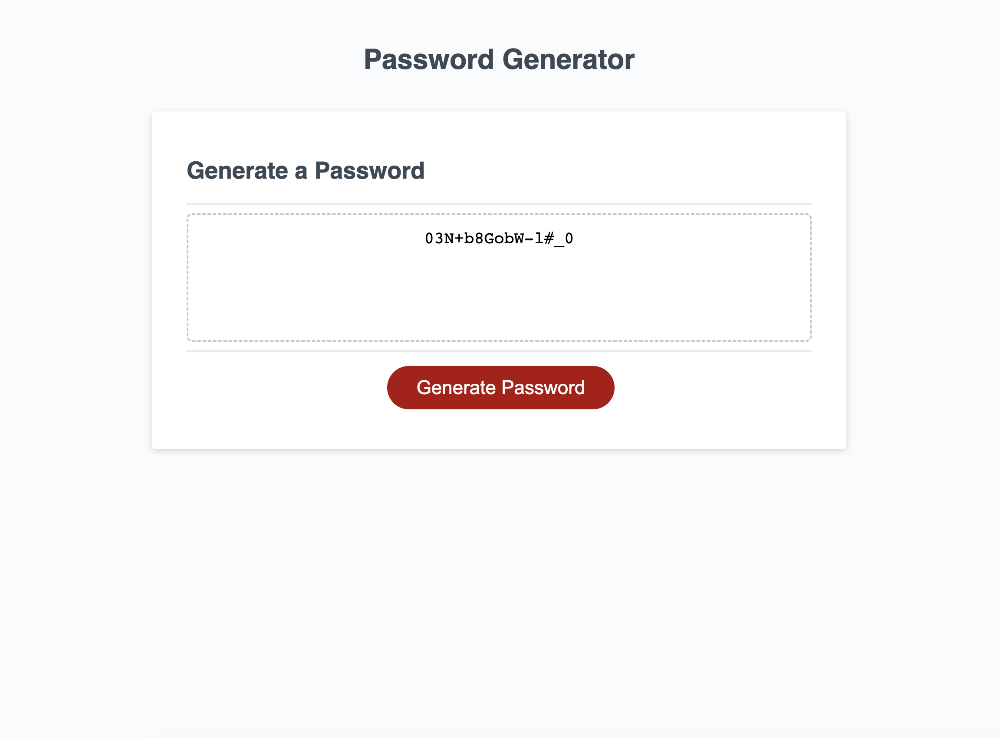

# Password Generator

## Creating a Password Generator
In this project I developed and delpoyed a password generator, that takes in user input, and based on the input will create a password. Users will be asked how long they would like their password to be, and what types of characters they would like included in the password.

### Techologies 
* HTML
* JavaScript
* CSS

## Links
[GitHub URL](https://github.com/TylerFarrior91/Password-Generator)\
[Live URL](https://tylerfarrior91.github.io/Password-Generator/)

## Screenshots

